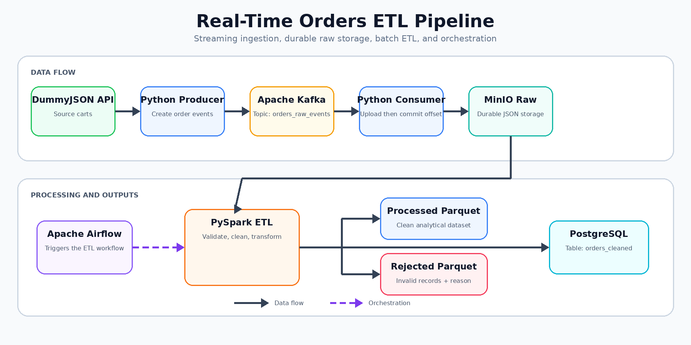

# Real-Time Orders ETL Pipeline

An end-to-end data engineering project that combines **real-time event ingestion** with **batch ETL processing**.

Order events are generated from the DummyJSON API, streamed through Apache Kafka, stored in MinIO, processed with PySpark, and loaded into PostgreSQL. Apache Airflow orchestrates the ETL workflow, while Docker Compose runs the complete local stack.

## Architecture



> Solid arrows represent data movement. The dashed arrow shows Airflow orchestrating the Spark job.

## Tech Stack

`Python` · `Apache Kafka` · `MinIO` · `PySpark` · `PostgreSQL` · `Apache Airflow` · `Docker Compose`

## How the Pipeline Works

1. The producer fetches carts from DummyJSON and creates order events.
2. Events are published to the Kafka topic `orders_raw_events`.
3. The consumer stores each event in MinIO.
4. Kafka offsets are committed only after a successful MinIO upload.
5. Airflow triggers the PySpark ETL job.
6. Spark validates, cleans, and transforms the raw data.
7. Clean records are stored as processed Parquet and loaded into PostgreSQL.
8. Invalid records are stored separately with a `rejection_reason`.

## Key Features

- Real-time ingestion with Kafka.
- Manual offset commits for at-least-once processing.
- Durable raw-event storage in MinIO.
- PySpark validation, cleaning, and transformation.
- Separate processed and rejected datasets.
- PostgreSQL serving table for clean records.
- Airflow workflow orchestration.
- Fully containerized infrastructure with persistent volumes.

## Data Quality Validation

The ETL job rejects records containing missing identifiers, event time, city, order status, payment method, missing or invalid total amounts, or missing/negative delivery fees.

Rejected records include a `rejection_reason` column describing the detected issue.

## Project Structure

```text
real-time-orders-etl-pipeline/
├── airflow/
│   ├── dags/orders_etl_dag.py
│   └── Dockerfile
├── consumer/app.py
├── producer/app.py
├── spark/jobs/orders_etl.py
├── sql/init.sql
├── docs/architecture.png
├── docker-compose.yml
├── .env.example
└── README.md
```

## Run Locally

Create `.env.local` from `.env.example`, then start the infrastructure:

```bash
docker compose up -d --build
```

Create and activate a Python virtual environment:

```bash
python -m venv .venv
```

Windows PowerShell:

```powershell
.venv\Scripts\Activate.ps1
```

Install the producer and consumer dependencies:

```bash
pip install -r producer/requirements.txt
pip install -r consumer/requirements.txt
```

Start the consumer:

```bash
python consumer/app.py
```

Start the producer in another terminal:

```bash
python producer/app.py
```

Open Airflow:

```text
http://localhost:8080
```

Enable and trigger:

```text
orders_etl_pipeline
```

## Verify the Output

Clean records are loaded into the PostgreSQL table:

```text
orders_cleaned
```

```sql
SELECT COUNT(*)
FROM orders_cleaned;
```

A successful Airflow task ends with:

```text
Orders ETL job completed successfully.
Command exited with return code 0
```

## What This Project Demonstrates

Streaming ingestion, event-driven architecture, data lake storage, PySpark ETL, data-quality handling, workflow orchestration, PostgreSQL loading, and Dockerized infrastructure.
