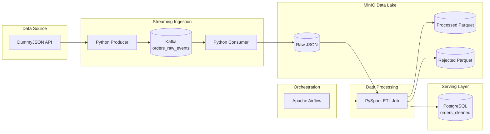
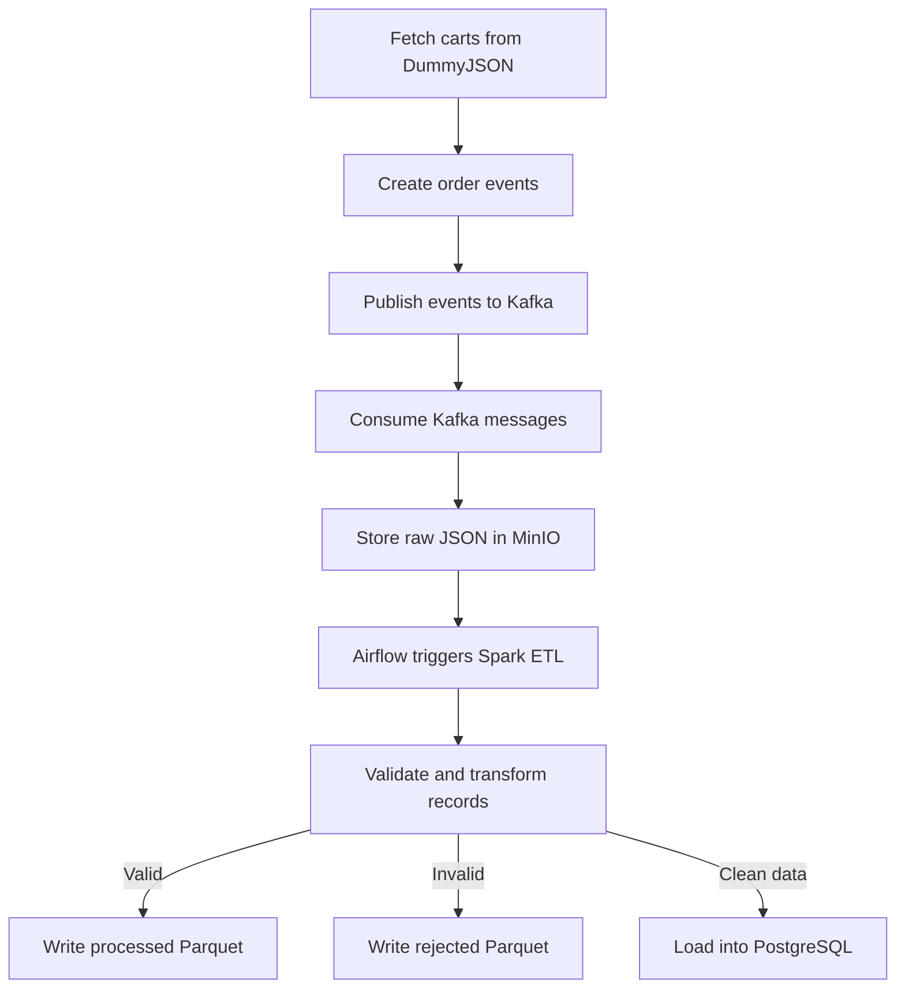

# Real-Time Orders ETL Pipeline

An end-to-end data engineering project that combines **real-time streaming ingestion** with **batch ETL processing**.

The pipeline generates order events from the DummyJSON API, publishes them to Apache Kafka, stores raw events in MinIO, processes them using PySpark, separates valid and rejected records, loads clean data into PostgreSQL, and orchestrates the ETL job with Apache Airflow.

---

## Architecture



---

## Pipeline Flow



---

## Tech Stack

| Technology     | Purpose                            |
| -------------- | ---------------------------------- |
| Python         | Producer and consumer applications |
| Apache Kafka   | Real-time event streaming          |
| MinIO          | S3-compatible data lake            |
| Apache Spark   | Data validation and transformation |
| PostgreSQL     | Serving database                   |
| Apache Airflow | ETL orchestration                  |
| Docker Compose | Local infrastructure management    |

---

## Key Features

* Real-time order-event ingestion with Kafka.
* Manual Kafka offset commits after successful MinIO uploads.
* Raw events stored as partitioned JSON files.
* PySpark validation, cleaning, and transformation.
* Separate processed and rejected data layers.
* Parquet output partitioned by event date.
* Clean records loaded into PostgreSQL using JDBC.
* Spark ETL jobs orchestrated through Airflow.
* Fully containerized infrastructure with persistent volumes.
* Simulated upstream data-quality issues for realistic testing.

---

## Data Lake Structure

```text
data-lake/
├── raw/
│   └── orders/
│       └── year=YYYY/
│           └── month=MM/
│               └── day=DD/
│                   └── hour=HH/
├── processed/
│   └── orders/
│       └── event_date=YYYY-MM-DD/
└── rejected/
    └── orders/
        └── event_date=YYYY-MM-DD/
```

---

## Data Quality Checks

The Spark ETL job rejects records containing:

* Missing event or order identifiers.
* Missing event time.
* Missing city.
* Missing order status.
* Missing payment method.
* Missing or invalid total amount.
* Missing or negative delivery fee.

Rejected records include a `rejection_reason` column describing the detected issues.

Example:

```text
missing_city,negative_delivery_fee
```

---

## Project Structure

```text
real-time-orders-etl-pipeline/
├── airflow/
│   ├── dags/
│   │   └── orders_etl_dag.py
│   └── Dockerfile
├── consumer/
│   ├── app.py
│   └── requirements.txt
├── producer/
│   ├── app.py
│   └── requirements.txt
├── spark/
│   ├── jobs/
│   │   └── orders_etl.py
│   └── requirements.txt
├── sql/
│   └── init.sql
├── .env.example
├── .gitignore
├── docker-compose.yml
└── README.md
```

---

## Running the Project

### 1. Configure environment variables

Create `.env.local` based on `.env.example`.

```bash
cp .env.example .env.local
```

Update the local credentials and configuration values.

> Do not commit `.env.local` to Git.

### 2. Start the infrastructure

```bash
docker compose up -d --build
```

Check the running services:

```bash
docker compose ps
```

The `orders_airflow_init` container is expected to stop after completing the Airflow database setup.

### 3. Create a Python environment

```bash
python -m venv .venv
```

Windows:

```powershell
.venv\Scripts\Activate.ps1
```

Install dependencies:

```bash
pip install -r producer/requirements.txt
pip install -r consumer/requirements.txt
```

### 4. Start the consumer

```bash
python consumer/app.py
```

### 5. Start the producer

Open another terminal:

```bash
python producer/app.py
```

### 6. Run the Airflow DAG

Open the Airflow interface:

```text
http://localhost:8080
```

Local login:

```text
Username: admin
Password: admin
```

Enable and trigger:

```text
orders_etl_pipeline
```

---

## Service Endpoints

| Service       | Address                 |
| ------------- | ----------------------- |
| Airflow UI    | `http://localhost:8080` |
| MinIO API     | `http://localhost:9000` |
| MinIO Console | `http://localhost:9001` |
| Kafka         | `localhost:9092`        |
| PostgreSQL    | `localhost:5432`        |
| Spark UI      | `http://localhost:4040` |

The Spark UI is available only while a Spark job is running.

---

## Output

Clean records are loaded into:

```text
orders_cleaned
```

Example verification query:

```sql
SELECT COUNT(*)
FROM orders_cleaned;
```

Inspect recent records:

```sql
SELECT *
FROM orders_cleaned
ORDER BY processed_at DESC
LIMIT 20;
```

Example successful ETL execution:

```text
Raw orders: 67
Clean orders: 50
Rejected orders: 17
Orders ETL job completed successfully.
Command exited with return code 0
```

---

## Processing Model

This project uses a hybrid architecture:

```text
Kafka Producer and Consumer → Streaming ingestion
Spark ETL Job              → Batch processing
Airflow                    → Workflow orchestration
```

Kafka handles incoming events in real time, while MinIO provides durable raw storage that allows the data to be replayed and reprocessed later.

---

## What This Project Demonstrates

* Streaming data ingestion.
* Event-driven architecture.
* Data lake design.
* PySpark ETL development.
* Data-quality validation.
* Workflow orchestration.
* PostgreSQL data serving.
* Dockerized data infrastructure.
* End-to-end pipeline troubleshooting.
